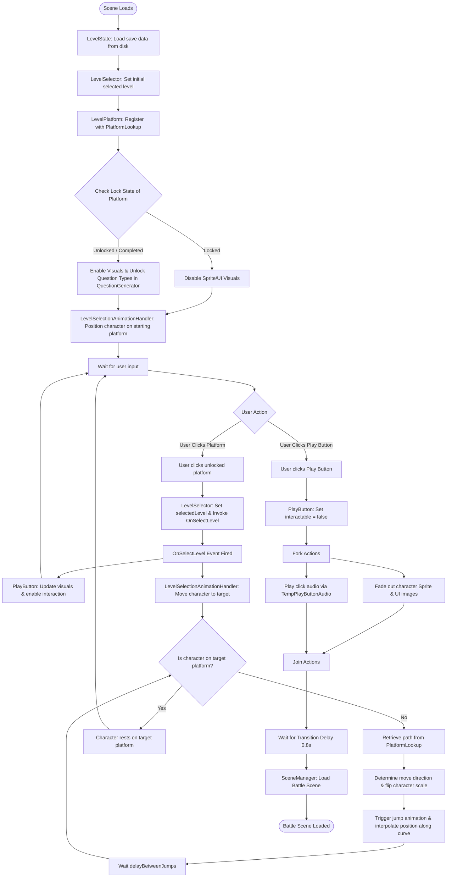

# Level Selection Activity Diagram

This diagram maps the control flow of the level selection scene from initialization up to loading the battle scene.

```mermaid
flowchart TD
    Start([Scene Loads]) --> LoadSave[LevelState: Load save data from disk]
    LoadSave --> InitSelector[LevelSelector: Set initial selected level]
    InitSelector --> RegisterPlatforms[LevelPlatform: Register with PlatformLookup]
    
    RegisterPlatforms --> CheckLockState{Check Lock State of Platform}
    
    CheckLockState -- Locked --> HidePlatform[Disable Sprite/UI Visuals]
    CheckLockState -- Unlocked / Completed --> ShowPlatform[Enable Visuals & Unlock Question Types in QuestionGenerator]
    
    HidePlatform --> InitChar
    ShowPlatform --> InitChar
    
    InitChar[LevelSelectionAnimationHandler: Position character on starting platform] --> WaitSelect[Wait for user input]
    
    WaitSelect --> UserAction{User Action}
    
    UserAction -- User Clicks Platform --> ClickPlatform[User clicks unlocked platform]
    ClickPlatform --> SetLevel[LevelSelector: Set selectedLevel & Invoke OnSelectLevel]
    
    SetLevel --> OnSelectEvent[OnSelectLevel Event Fired]
    
    OnSelectEvent --> PlayBtnInteract[PlayButton: Update visuals & enable interaction]
    OnSelectEvent --> AnimMove[LevelSelectionAnimationHandler: Move character to target]
    
    AnimMove --> TargetCheck{Is character on target platform?}
    TargetCheck -- No --> GetPath[Retrieve path from PlatformLookup]
    GetPath --> FaceDir[Determine move direction & flip character scale]
    FaceDir --> JumpNext[Trigger jump animation & interpolate position along curve]
    JumpNext --> DelayJump[Wait delayBetweenJumps]
    DelayJump --> TargetCheck
    
    TargetCheck -- Yes --> IdleChar[Character rests on target platform]
    IdleChar --> WaitSelect
    PlayBtnInteract --> WaitSelect
    
    UserAction -- User Clicks Play Button --> ClickPlay[User clicks Play Button]
    ClickPlay --> DisablePlay[PlayButton: Set interactable = false]
    
    DisablePlay --> Fork[Fork Actions]
    
    Fork --> FadeChar[Fade out character Sprite & UI images]
    Fork --> PlaySFX[Play click audio via TempPlayButtonAudio]
    
    FadeChar --> Join[Join Actions]
    PlaySFX --> Join
    
    Join --> Delay[Wait for Transition Delay 0.8s]
    Delay --> LoadScene[SceneManager: Load Battle Scene]
    LoadScene --> End([Battle Scene Loaded])
```
